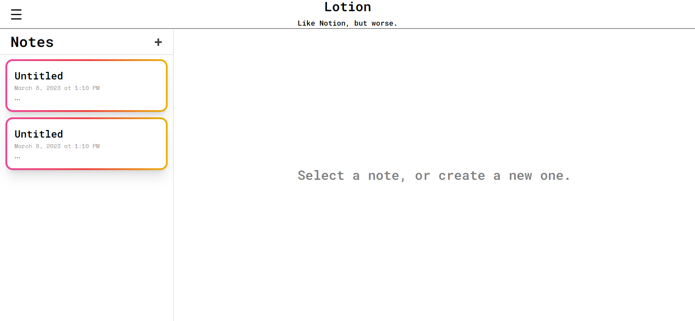

# About The Project

This is a Web Application built as part of the course content for <a href="https://contacts.ucalgary.ca/info/enel/courses/w23/ENSF381?destination=courses%2Fw23">ENSF 381 (W23)</a> . The application serves as a note taking application that implements features such as local Storgae, so that the users personal data can be retained if the website is revisited.

This is a preview of the website design:



## Dependencies
You will have to run the following items of code to install all required dependencies

```
npm install react-router-dom
```

```
npm install react-quill
```

```
npm install uuid
```

After installing the required dependencies you can run ```npm start``` in the root directory to run the project

## Built With

// To be updated soon
